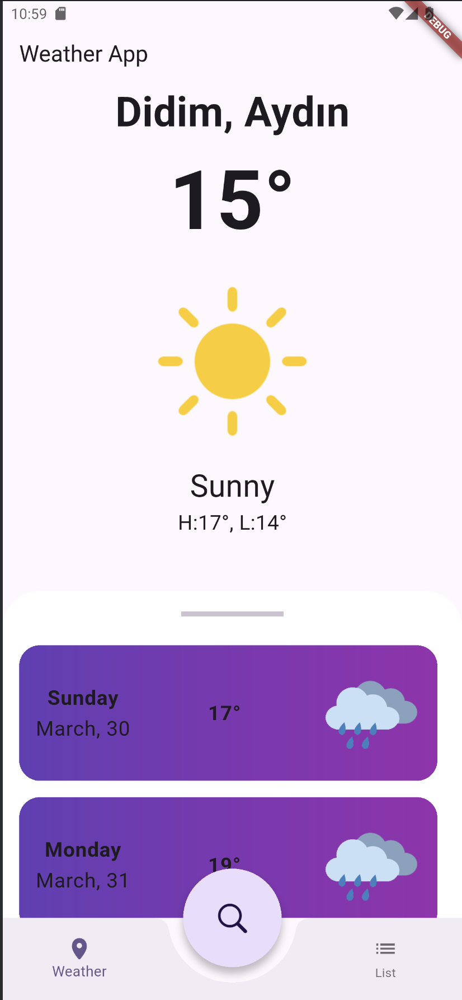
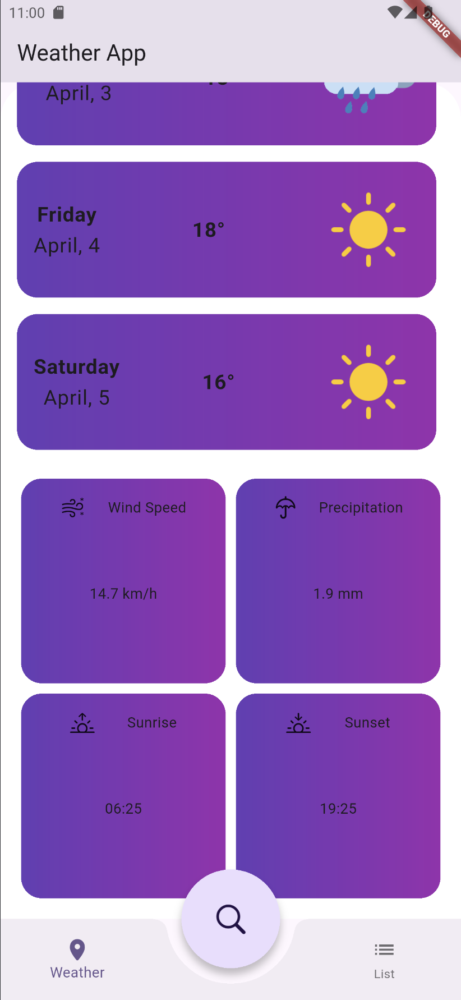
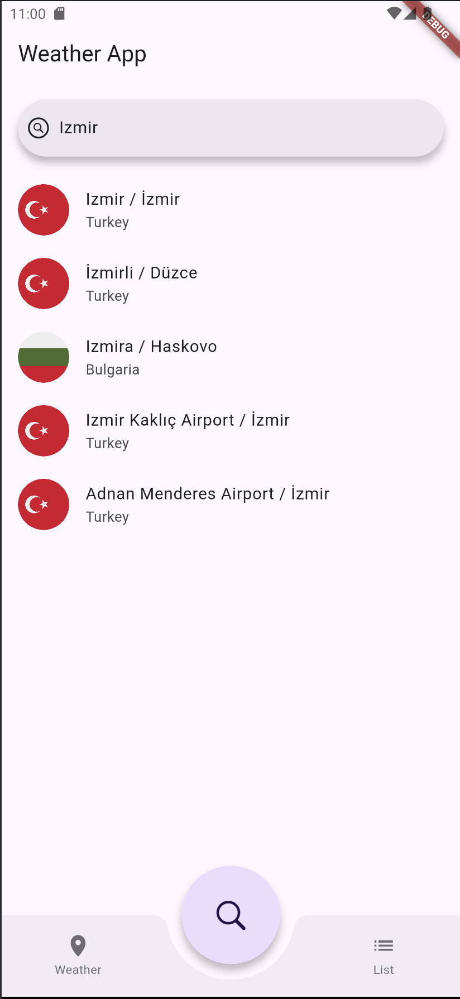
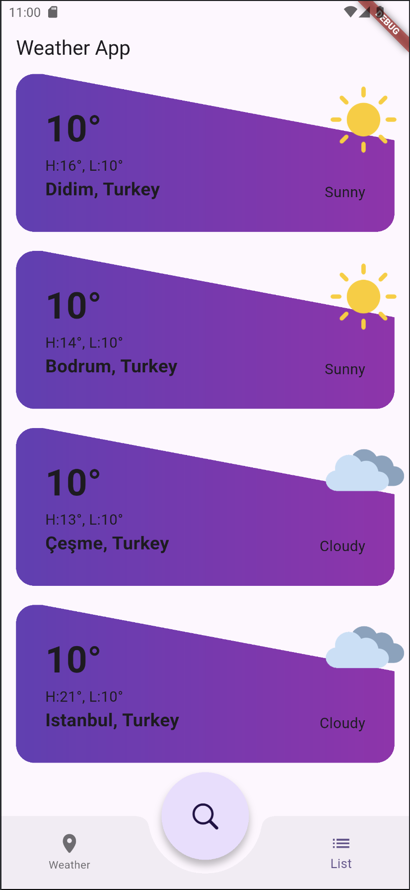
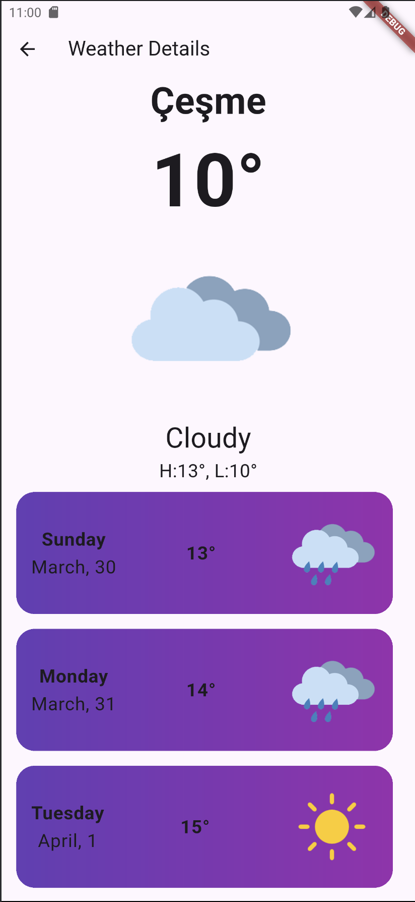

# Weather Application - In development..

### Description
We have the right to take legal action in the event that the application is shared on the internet, distribution, claiming right ownership, selling it for a fee.
These codes are shared only for you to learn the Flutter.
Anyone who have access to the codes is agreed to have unconditionally accepted these terms.

All Rights Reserved. 
APPBeta Mobile - www.APPBeta.net - Berk ORHAN BETA

## About Application
This project is a mobile application developed to provide users with weather data. The app retrieves real-time weather information based on the user's location. Users can view the weather conditions of any city worldwide.

The purpose of the app is to present weather forecasts accurately and quickly, helping users plan their day more efficiently.

* get: State management and dependency injection.
* dio: A popular library for making HTTP requests.
* geolocator: For retrieving the user's geographical location.
* geocoding: For converting addresses into geographical coordinates.
* shared_preferences: For storing user data locally.
* provider: State management.
* cached_network_svg_image: For caching SVG images from the network.
* intl: For internationalization in date and time processing.

- Framework: Flutter
- Programming Language: Dart
- Platform: Android, iOS, Web

## Screenshots from Application

